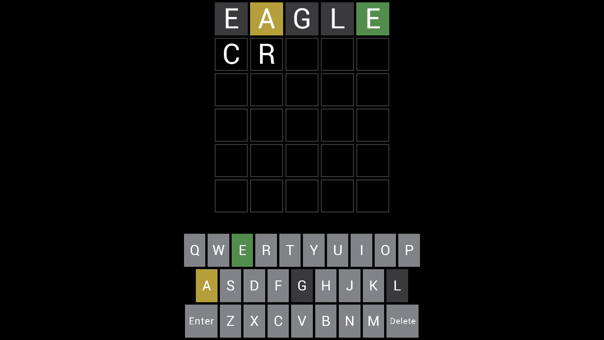

# cpp-wordle

A small [Wordle](https://en.wikipedia.org/wiki/Wordle) clone written in modern
C++23 — a streamlined port of a game originally written in Odin. Guess the hidden
five-letter word in six tries; each guess is scored green (right letter, right
spot), yellow (right letter, wrong spot), or grey (not in the word), and the
on-screen keyboard tracks what you've learned.



## Features

- Full Wordle rules, including correct duplicate-letter scoring (two-pass).
- Physical **and** on-screen (clickable) keyboard, both tinted by letter state.
- Guess validation with toast messages ("Not enough letters", "Not in word
  list") and win/lose messages.
- A **New Game** button to start a fresh round.
- Word list loaded from [`words.json`](app/cpp-wordle/words.json) and smooth text
  from a Roboto TTF — both embedded into the binary at build time, so there are
  **no external asset files** to ship on any platform.
- Cross-platform: Windows, Linux, macOS, Web (Emscripten) and Android.

## Tech stack

| Concern            | Choice                                                  |
| ------------------ | ------------------------------------------------------- |
| Language           | C++23 (`std::print`, ranges, `std::views::enumerate`)   |
| Rendering / input  | [raylib](https://www.raylib.com/)                       |
| Enum reflection    | [magic_enum](https://github.com/Neargye/magic_enum)     |
| JSON parsing       | [nlohmann/json](https://github.com/nlohmann/json)       |
| Build / packaging  | CMake (presets) + [vcpkg](https://vcpkg.io) manifest mode |

The code follows a small MVC split, all under [`app/cpp-wordle/`](app/cpp-wordle):

| File                        | Role                                                        |
| --------------------------- | ----------------------------------------------------------- |
| `Game.hpp` / `Game.cpp`     | Rules and state — no rendering/input dependency              |
| `Dictionary.hpp` / `.cpp`   | Word list, target selection, guess validation               |
| `Messages.hpp`              | Timed toast queue (header-only)                             |
| `Render.hpp` / `Render.cpp` | View: grid, keyboard, button, toasts, layout, embedded font |
| `Input.hpp` / `Input.cpp`   | Controller: keyboard + mouse → game commands                |
| `main.cpp`                  | Window, frame loop, wiring                                  |

## Prerequisites

- **Git**
- **CMake ≥ 3.31**
- **Ninja** (the presets use the Ninja generator)
- A **C++23 compiler**:
  - **Windows** — MSVC from Visual Studio 2022 (or newer) / Build Tools, with the
    "Desktop development with C++" workload. Run the commands below from a
    **Developer Command Prompt / Developer PowerShell for VS** so `cl` and `ninja`
    are on `PATH`.
  - **Linux** — GCC or Clang, plus the OpenGL/X11 development packages raylib
    needs (e.g. `libgl1-mesa-dev`, `libx11-dev`, `xorg-dev`).
  - **macOS** — the Xcode Command Line Tools (Clang).

vcpkg itself does not need to be installed separately — it is bootstrapped
automatically on the first configure, and the dependencies above are built/fetched
from [`vcpkg.json`](vcpkg.json).

## 1. Clone

```sh
git clone https://github.com/funnansoftware/cpp-wordle.git
cd cpp-wordle
```

### Fetch vcpkg

The CMake toolchain expects a vcpkg checkout at `./vcpkg`. Clone it into the repo
root:

```sh
git clone https://github.com/microsoft/vcpkg.git vcpkg
```

## 2. Configure

Pick the preset for your platform (see the table below). For a Windows debug
build:

```sh
cmake --preset x64-windows-msvc-debug
```

The first configure bootstraps vcpkg and builds/installs the dependencies, so it
takes a few minutes; later configures are fast.

## 3. Build

```sh
cmake --build --preset x64-windows-msvc-debug
```

## 4. Run

The executable lands next to its sources inside the build tree:

```sh
# Windows
.\build\x64-windows-msvc-debug\app\cpp-wordle\cpp-wordle.exe

# Linux / macOS
./build/<preset>/app/cpp-wordle/cpp-wordle
```

## Presets

List the presets available for your host with `cmake --list-presets` (each preset
is shown only on the OS it targets).

| Platform            | Debug preset                    | Release preset                    |
| ------------------- | ------------------------------- | --------------------------------- |
| Windows (MSVC)      | `x64-windows-msvc-debug`        | `x64-windows-msvc-release`        |
| Linux (GCC)         | `x64-linux-gcc-debug`           | `x64-linux-gcc-release`           |
| Linux (Clang)       | `x64-linux-clang-debug`         | `x64-linux-clang-release`         |
| macOS (Clang, arm64)| `arm64-macos-clang-debug`       | `arm64-macos-clang-release`       |
| Web (Emscripten)    | `x64-linux-emcc-debug`          | `x64-linux-emcc-release`          |
| Android (NDK)       | `x64-linux-android-ndk-debug`   | `x64-linux-android-ndk-release`   |

Swap `-debug` for `-release` in the configure/build commands to make an optimized
build.

The **Web** presets need the [Emscripten SDK](https://emscripten.org) on `PATH`
and produce `cpp-wordle.html` / `.js` / `.wasm` (serve them over HTTP and open the
`.html`). The **Android** presets need the Android SDK + NDK and produce an APK.

## How to play

- Type letters **A–Z**, press **Enter** to submit a guess, **Backspace** to
  delete — or click the on-screen keyboard.
- You get **6 guesses**. Tiles and keys turn **green** (correct spot),
  **yellow** (in the word, wrong spot) or **grey** (not in the word).
- After a win or loss, click **New Game** to play again.

## License

[MIT](LICENSE) © Funnan Software. Bundled Roboto font is © The Roboto Project
Authors, Apache License 2.0 (see
[`app/cpp-wordle/assets/Roboto-LICENSE.txt`](app/cpp-wordle/assets/Roboto-LICENSE.txt)).
